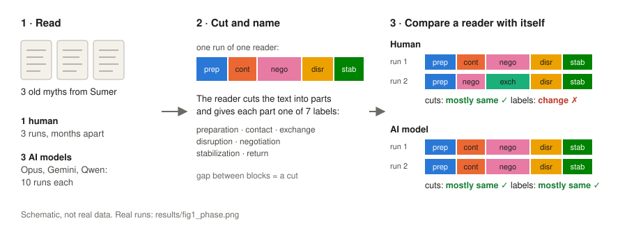
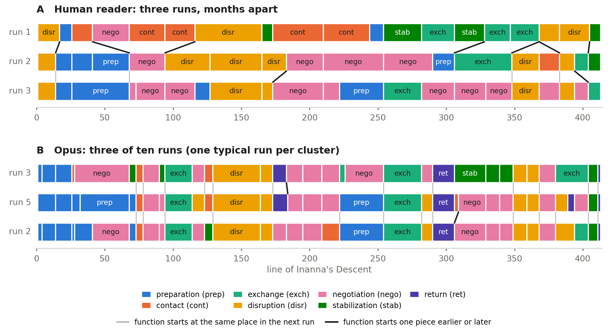

# Intra-annotator dynamics

Most training data records what people say about a text: a label, a summary, an answer.
We argue for a new kind of data: **how one reader's own reading changes over time.**
The same reader cuts and labels the same text again, months later, and the changes are not noise.

This repo tests the idea on a small case. One human and three AI models read three old myths.
Each reader cut every text into parts and gave each part a label, several times.
Then we asked: **does a reader agree with *themselves*?**



What we found:

- The human cuts the text in **almost the same places** every time, even months later.
- But the human often gives those parts **different labels**. The models keep both.
- The human's labels do not change at random. The same functions come back,
  but they **start one step earlier or later**. The models start them at the same place.
- So a record of one reader over time shows something that a single label,
  or a vote of many people, cannot show.

This repo has all the data and code for our paper (under review).
One command runs everything and checks every number against the paper.

## Quick start

You only need Python 3. The figure also needs `matplotlib`.

```
pip install -r requirements.txt     # only matplotlib
python3 reproduce.py                # all steps, a few minutes
```

You will see lines like this:

```
== table1: Table 1 (human kappas and gap), §4.1 boundary placement, Table 3 (B2), §7 (c, d).
  ok  gudea: boundary kappa        paper   0.465   now   0.465
  ok  gudea: label kappa           paper   0.168   now   0.168
  ok  gudea: gap                   paper  +0.298   now  +0.298
```

`ok` means the number is the same as in the paper. `XX` would mean it is not.
At the end you get `all numbers match the paper`.

Run only some steps:

```
python3 reproduce.py --list          # show all steps
python3 reproduce.py table1 table4   # run two of them
```

Everything the scripts print is saved in `results/`.

## The files

```
reproduce.py            runs every step and checks the numbers        (~170 lines)
src/
  projection.py         turns one reading into labels per text unit   (~200 lines)
  paper_results.py      compares runs: kappa, gap, B2                 (~230 lines)
  b1_volume_null.py     B1: do runs disagree on the same places?      (~120 lines)
  b2_models_matched.py  B2 for the models, at 3 runs                  (~50 lines)
  lag_test.py           phase shift: where does a function start?     (~250 lines)
  passage_inspection.py mirrored pairs on Inanna & Enki               (~260 lines)
  fig1_phase.py         draws Figure 1                                (~90 lines)
  world_model_metrics/  transferable grammar (Table 5)
data/<myth>/            human1_run1-3, opus/gemini/qwen_run1-10
texts/                  the three myths, with line numbers
prompts/                the prompt given to the models
results/                output of every step
```

Only standard Python is used for all numbers. No numpy, no pandas.

## How each number is made

Every metric answers one question. Below: the question, where the code is,
and the few lines that do the work.

### 1. From a reading to text units

A reader's segment covers some lines, for example lines 26–40.
Two readers cut in different places, so we cannot compare segments directly.
We compare **units** instead: a unit is one text line
(for Inanna & Enki, one block of lines). Each unit gets the label of the segment
that covers it. A unit is a **boundary** if a segment starts there.

`src/projection.py`, function `project()`:

```python
for k, s in enumerate(segments):
    a, b = s["line_start"], s["line_end"]
    covered = [idx[ln] for ln in range(a, b + 1) if ln in idx]
    bounds.add(covered[0])                  # the first unit of a segment is a boundary
    for u in covered:
        votes.setdefault(u, Counter())[lab] += 1
labels = {u: max(c, ...) for u, c in votes.items()}   # each unit: label of the segment covering it
```

Lines that are missing in the old text (lacunae, or only `...`) are not units.

### 2. Does a reader agree with themselves? (Tables 1 and 2)

We take two runs of the same reader and compare them unit by unit,
once for labels (7 classes) and once for boundaries (2 classes: boundary or not).
We use Cohen's kappa: it removes the agreement you would get by chance.

`src/paper_results.py`, functions `kappa()` and `boundary_label_kappas()`:

```python
def kappa(a, b, cats):
    n = len(a); po = sum(x == y for x, y in zip(a, b)) / n     # observed agreement
    ca = Counter(a); cb = Counter(b)
    pe = sum((ca[c] / n) * (cb[c] / n) for c in cats)          # agreement by chance
    return (po - pe) / (1 - pe)
```

The **gap** is boundary kappa minus label kappa.
For the human it is large and positive in all three myths.
For the models it is positive in some myths and negative in others.

### 3. B1: do the runs disagree on the same places? (Table 3)

For each unit we count how many runs leave its most common label.
Then we ask: do different runs leave it on the **same** units,
more often than if the same number of changes were spread at random?

`src/b1_volume_null.py`, function `votes()`:

```python
tup = [tuple(m[u] for m in labs) for u in units]          # the labels of all runs on one unit
v = [K - Counter(t).most_common(1)[0][1] for t in tup]    # how many runs leave the common label
```

Answer for the human: no. The changes are spread out, not stacked on a few hard units.

### 4. B2: is the new label taken from a neighbour? (Table 3)

When one run gives a passage a different label, is that label the one
of the passage just before or just after?

`src/paper_results.py`, function `b2()`:

```python
if x in lab and lab[x] != maj[x]:          # this run leaves the majority label
    i = fid[x]; ok = lab[x] in nb[i]       # is the new label a neighbour's label?
```

All readers do this, the models even more. So B2 tells us about the label scheme,
not about the human.

### 5. Phase shift: where does a function start? (Table 4, Figure 1)

Cut the text at every boundary of every run: these small stretches are **pieces**.
When a run switches to a function, look where another run starts the same function.
Same piece? One piece earlier or later? Further away?

`src/lag_test.py`, functions `onsets()` and `onset_lags()`:

```python
def onsets(s):                                  # pieces where a run switches function
    return [(j, s[j]) for j in range(1, len(s)) if s[j] != s[j - 1]]

d = min((i - j for i in oa[x]), key=lambda v: (abs(v), v))   # distance to the same function in the other run
```

The human starts functions one step apart much more often than chance.
The models start them in the same place.



### 6. Transferable grammar: the same order of functions in every myth? (Table 5)

Learn from two myths how often each function follows each other function.
Use this to predict the order in the third myth. The **gain** says how much better
this is than only knowing how common each function is (in bits per step).

`src/world_model_metrics/A_transfer.py`, functions `fit_grammar()` and `eval_gain()`:

```python
for a, b in pairs(seq):                                   # a function and the next one
    tot += logP_cond[(a, b)] - logP_marg[b]               # better or worse than plain frequency?
```

The models carry one grammar across myths. The human's grammar stays inside each myth.

## Which step makes which number

| In the paper | Step in `reproduce.py` | Script |
|---|---|---|
| §3.4 units, one edge inside a block | `units` | `projection.py` |
| Table 1, §4.1 | `table1` | `paper_results.py` |
| Table 2 | `table2` | `paper_results.py` |
| Table 3, B1 | `table3_b1` | `b1_volume_null.py` |
| Table 3, B2 | `table1` | `paper_results.py` |
| §4.3, B2 for the models | `b2_models` | `b2_models_matched.py` |
| Table 4 | `table4` | `lag_test.py` |
| §4.3, mirrored pairs | `mirrors` | `passage_inspection.py` |
| Table 5, §4.4 | `table5` | `A_transfer.py`, `robustness_check.py` |
| §7 (a) | `agreement` | `paper_results.py --agreement` |
| Figure 1 | `figure1` | `fig1_phase.py` |

Random baselines use fixed seeds, so you get the same numbers every time.

## The data

`data/<myth>/<reader>_run<N>.json` — one file per run.
`human1` is the human reader (3 runs, months apart).
`opus`, `gemini`, `qwen` are the models (10 runs each, each in a fresh session).

Each file has a list of `segments`. The code uses three fields of each segment:

```json
{ "function": "negotiation", "line_start": 41, "line_end": 67 }
```

The other fields (`transition_from`, `markers`, `evidence`, ...) are kept as they were produced,
but no number in the paper uses them.

`prompts/` holds the prompt given to the models, in two versions:
`seg_v4.txt` for texts split into lines (Gudea, Inanna's Descent)
and `seg_v5.txt` for texts split into blocks (Inanna & Enki).
The block version also tells the model that gaps in numbering are lacunae,
and it differs in small formatting (fewer colons and quotes).
Both files are exactly as the models received them.

## The texts, and credits

The three myths are English translations, cleaned and given line numbers for this study.

- Gudea Cylinders: CDLI P431881 (RIME 3/1.01.07), https://cdli.earth
- Inanna's Descent: CDLI P468903, https://cdli.earth
- Inanna and Enki: ETCSL 1.3.1. Black, J.A., Cunningham, G., Ebeling, J., Flückiger-Hawker, E., Robson, E., Taylor, J., and Zólyomi, G., *The Electronic Text Corpus of Sumerian Literature* (http://etcsl.orinst.ox.ac.uk/), Oxford 1998–2006.

The texts are shared for academic research only.

## What this repo does not do

- There is **one** human reader. We cannot say if other people read the same way.
- The human ran 3 times, the models 10 times. Where it matters, we compare at 3 runs.
- The phase-shift test was designed after we saw the pattern in the data (exploratory).
- Human runs are months apart; model runs were made close together in time. We do not compare their levels directly.

## License

- **Code** (`src/`, `reproduce.py`): MIT, see [LICENSE](LICENSE).
- **Annotations** (`data/`): [CC BY 4.0](https://creativecommons.org/licenses/by/4.0/).
  You may use them for anything, if you cite the paper.
- **Texts** (`texts/`): not ours. They follow the terms of CDLI and ETCSL (see above).

## Citation

Anonymous submission, under review.
